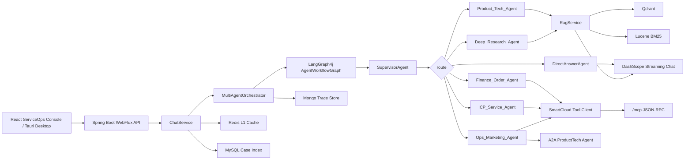

# SmartCloud ServiceOps

SmartCloud is an interview-oriented industrial cloud customer service platform implemented in Java. It combines Spring Boot WebFlux, LangGraph4j, LangChain4j, Agentic RAG, hybrid retrieval, local tool adapters, and a React operations console.

## Highlights

- Spring Boot 3 + WebFlux streaming backend
- LangGraph4j multi-agent workflow orchestration
- Five specialist agents: product tech, finance/order, ICP filing, marketing ops, and deep research
- LangChain4j + DashScope chat, embedding, vision, and reranking models
- Agentic RAG with Qdrant vector retrieval and Lucene BM25-style lexical retrieval
- Redis L1 cache plus existing RAG/semantic cache fallback
- MySQL tenant billing schema, Mongo-style trace persistence hook, and lightweight Saga compensation log
- MCP Streamable HTTP-style JSON-RPC endpoint and A2A Agent Card/message demo
- Deterministic H5 landing page and PNG poster generator for marketing scenarios
- Actuator + Prometheus metrics with Grafana dashboard provisioning
- React 19 + Ant Design SmartCloud service console
- Knowledge upload, website crawl/update, semantic cache, persistent conversations, and runtime settings

## Architecture



Runtime flow:

```text
User case
 -> ChatService
 -> MultiAgentOrchestrator
 -> LangGraph4j AgentWorkflowGraph
 -> SupervisorAgent route decision
 -> Specialist Agent / DirectAnswerAgent
 -> VerifierAgent guard
 -> SSE Flux<String> response
```

Each response starts with a trace chunk such as:

```text
__THINK__Graph route: supervisor -> finance_order -> verifier; selected=Finance_Order_Agent; reason=billing__ENDTHINK__
```

LangGraph4j owns the control plane: route selection, graph node trace, and agent selection. Reactor `Flux<String>` remains the data plane for token streaming, so `/api/chat` and the frontend contract stay simple and stable.

## Agent Routes

| Route | Agent | Responsibility |
| --- | --- | --- |
| `PRODUCT_TECH` | `ProductTechAgent` | Cloud product consultation, ECS, GPU, database, storage, networking, troubleshooting |
| `FINANCE_ORDER` | `FinanceOrderAgent` | Billing, orders, invoices, renewal, refund, cost analysis |
| `ICP_SERVICE` | `IcpServiceAgent` | ICP filing materials, procedure, risk notice |
| `OPS_MARKETING` | `OpsMarketingAgent` | Promotion copy, poster brief, share landing page |
| `DEEP_RESEARCH` | `DeepResearchAgent` | Technical selection report and architecture comparison |
| `DIRECT` | `DirectAnswerAgent` | General non-RAG conversation |
| `WEB_REFRESH` | crawler fallback | Emits a trace notice and answers from indexed knowledge in v1 |

## Requirements

- JDK 17 or newer
- Node.js 20 or newer for frontend development
- A DashScope API key
- Microsoft Edge or Google Chrome for browser-based crawling

## Quick Start

```powershell
cd D:\RAG-Java-MultiAgent
Copy-Item .env.example .env
```

Set `DASHSCOPE_API_KEY` in `.env`, then start the backend:

```powershell
.\mvnw.cmd spring-boot:run
```

Open [http://127.0.0.1:8000](http://127.0.0.1:8000).

Demo login:

```text
tenant: tenant-demo
username: demo-admin
password: demo123456
```

Optional local infrastructure:

```powershell
docker compose up -d mysql mongo redis prometheus grafana
```

Enable the backing services in `.env`:

```env
SMARTCLOUD_SQL_ENABLED=true
SMARTCLOUD_MONGO_ENABLED=true
SMARTCLOUD_REDIS_ENABLED=true
```

Frontend development:

```powershell
cd frontend
npm.cmd run lint
npm.cmd run build
```

The Vite build writes production assets to `src/main/resources/static`, where Spring Boot serves them.

## Validation

```powershell
$env:JAVA_HOME="C:\Program Files\Android\Android Studio\jbr"
$env:Path="$env:JAVA_HOME\bin;$env:Path"
java -version
.\mvnw.cmd test

cd frontend
npm run lint
npm run build
```

## Main API Endpoints

| Method | Endpoint | Purpose |
| --- | --- | --- |
| `GET` | `/api/health` | Application health |
| `POST` | `/api/chat` | Streaming multi-agent chat |
| `POST` | `/api/auth/login` | Demo JWT login |
| `GET` | `/api/auth/me` | Current tenant/user context |
| `GET` | `/api/billing/summary` | Tenant billing summary |
| `GET` | `/api/billing/invoices` | Tenant invoice list |
| `GET` | `/api/traces` | Local Agent trace list |
| `POST` | `/api/marketing/generate` | Generate H5 and poster assets |
| `GET` | `/api/assets/marketing/{assetId}/{filename}` | Serve marketing assets |
| `POST`, `GET`, `DELETE` | `/mcp` | MCP Streamable HTTP-style endpoint |
| `GET` | `/.well-known/agent-card.json` | A2A Agent Card |
| `POST` | `/message:send` | A2A synchronous message |
| `POST` | `/message:stream` | A2A SSE message stream |
| `GET`, `POST` | `/api/settings` | Runtime settings |
| `GET`, `POST` | `/api/prompt` | System prompt management |
| `GET` | `/api/documents` | Knowledge document list |
| `POST` | `/api/upload` | Document upload |
| `GET` | `/api/document-chunks` | Indexed chunk inspection |
| `POST` | `/api/training/start` | Start indexing |
| `POST` | `/api/knowledge/update` | Crawl and refresh knowledge |
| `GET` | `/api/knowledge/stats` | Knowledge statistics |
| `GET` | `/api/scheduler/status` | Crawler scheduler status |

## Project Structure

```text
src/main/java/com/ftsm/rag/agent/       Multi-agent workflow and SmartCloud agents
src/main/java/com/ftsm/rag/controller/  Chat, auth, billing, MCP, A2A, trace, marketing APIs
src/main/java/com/ftsm/rag/service/     RAG, indexing, crawler, model, cache services
src/main/resources/db/migration/        SmartCloud MySQL demo schema and seed data
src/main/resources/static/              Built React frontend
src/main/resources/prompts/             System and RAG prompts
src/test/java/                          Backend tests
frontend/                               React and Tauri source
data/smartcloud_kb/                     Fictional SmartCloud seed knowledge documents
qdrant_local/                           Local Qdrant executable and runtime data
docs/                                   Architecture notes
observability/                          Prometheus and Grafana provisioning
```

## Notes

- `WEB_REFRESH` does not automatically trigger a destructive update in v1; it emits a trace and falls back to indexed knowledge.
- The local SmartCloud tool client is deterministic demo infrastructure. It can be replaced by MCP servers or internal APIs.
- `ReactAgent` is retained as a legacy single-agent comparison implementation.
- Knowledge content should be reviewed before public deployment.
