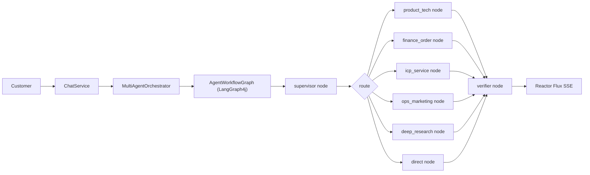

# SmartCloud LangGraph4j Multi-Agent Architecture

## Goal

SmartCloud turns the original RAG assistant into an industrial cloud customer service platform. The backend API remains `/api/chat`, but the internal chat path is now a LangGraph4j workflow with five specialist agents and a tool layer.

## Runtime Flow

## Agent Responsibilities

- `SupervisorAgent` asks the chat model for compact JSON routing and falls back to deterministic rules when routing fails.
- `ProductTechAgent` answers product and technical cloud questions through `RagService`.
- `FinanceOrderAgent` queries the SmartCloud tool layer for demo billing/order data.
- `IcpServiceAgent` generates ICP filing checklists and risk notices through the tool layer.
- `OpsMarketingAgent` generates campaign copy, poster prompts, and landing-page suggestions through the tool layer.
- `DeepResearchAgent` creates a research plan, then grounds the answer through Agentic RAG.
- `DirectAnswerAgent` handles general non-operational conversation with the streaming chat model.
- `VerifierAgent` is a v1 guard: direct answers pass through, and empty non-direct streams become a safe no-answer message.

## Tool Layer

`SmartCloudToolClient` is the MCP-ready seam. The current `LocalSmartCloudToolClient` is deterministic and testable:

- `queryBilling`
- `buildIcpChecklist`
- `createMarketingPackage`
- `createResearchPlan`

In production, these methods can be replaced by MCP servers, CRM APIs, billing APIs, CMS services, or image-generation services without changing the agent workflow.

## Why LangGraph4j Plus Reactor

LangGraph4j is the control plane: route selection, node trace, and future workflow branching. Reactor remains the data plane because `/api/chat` already streams `Flux<String>` chunks to the frontend. This keeps streaming responsive while making the agent workflow auditable.

## Interview Talking Points

- The project separates routing, retrieval, tools, verification, and streaming.
- The graph can be extended with a real `WebRefreshAgent`, source-aware verifier, or MCP server implementation.
- Tool calls are isolated behind an interface, so the demo can run locally while preserving an industrial integration shape.
- The frontend is an operations console, not a generic chat page: it shows agent roles, workflow trace, knowledge management, settings, and dashboard metrics.
